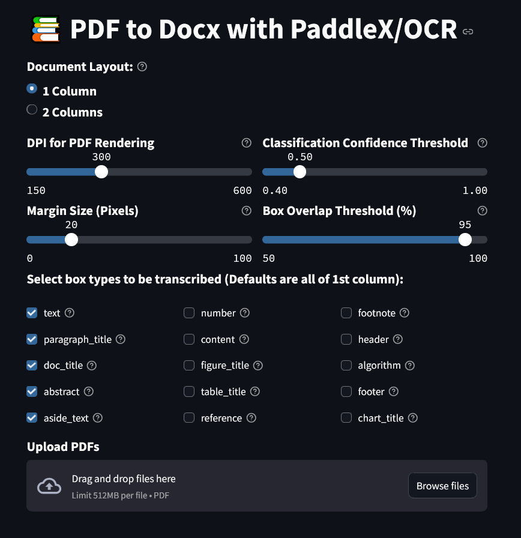
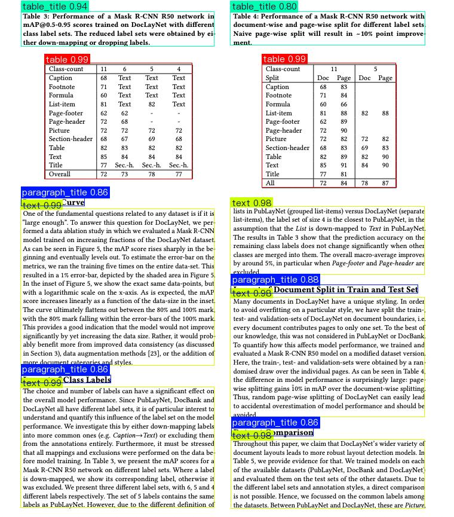
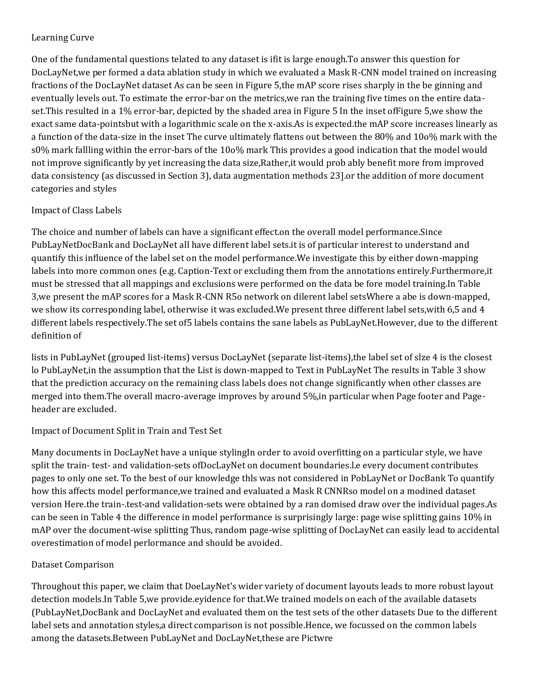

# Pdf2Docx OCR with PaddleX-PaddleOCR and Streamlit UI

A Streamlit-based tool for converting PDF documents to DOCX format using PaddleX and PaddleOCR for layout analysis and text extraction.    
This app is build to run on CPU, contributions are welcome for running on CUDA-compatible GPUs.



## Example of a PDF and a resulting DOCX, the setting "2 Columns" was used:

<p align="center">
    
    
</p>

## Features

- Convert PDF documents to DOCX while preserving text content
- Advanced layout detection using PaddleX
- Optical Character Recognition (OCR) with PaddleOCR
- Support for both single-column and two-column document layouts
- Customizable parameters for optimizing extraction quality
- Clean, intuitive user interface built with Streamlit


## Requirements

- Python 3.10
- PaddlePaddle
- PaddleX
- PaddleOCR
- PyMuPDF
- OpenCV
- Streamlit
- Other dependencies listed in requirements.txt

## Installation

1. Create a new conda environment:

```bash
conda create -n pdf2docx_paddlex_env python=3.10
conda activate pdf2docx_paddlex_env
```

2. Install PaddlePaddle, check [PaddlePaddle Install](https://paddlepaddle.github.io/PaddleX/latest/en/installation/paddlepaddle_install.html):

```bash
python -m pip install paddlepaddle==3.0.0rc1 -i https://www.paddlepaddle.org.cn/packages/stable/cpu/
```

3. Install PaddleX, check [PaddleX install](https://paddlepaddle.github.io/PaddleX/latest/en/installation/installation.html#21-get-paddlex-based-on-docker):

```bash
pip install https://paddle-model-ecology.bj.bcebos.com/paddlex/whl/paddlex-3.0.0rc0-py3-none-any.whl
```

4. Install other dependencies:

```bash
pip install paddleocr==2.10.0 pymupdf opencv-python numpy pillow python-docx streamlit albucore==0.0.16
```

## Usage

1. Run the application:

```bash
streamlit run app.py
```

2. Configure the Streamlit theme (optional):

Create a file named `.streamlit/config.toml` with the following content:

```toml
[browser]
gatherUsageStats = false

[theme]
base="dark"
primaryColor="#336699"

[server]
maxUploadSize = 512
```

3. Upload your PDF files and click "Start Conversion"

## Parameters

- **Document Layout**: Choose between one-column or two-column layouts
- **DPI for PDF Rendering**: Higher values give better quality but require more processing time
- **Margin Size**: Extra padding around detected text regions
- **Confidence Threshold**: Minimum confidence score for text detection
- **Box Overlap Threshold**: Controls removal of overlapping text regions
- **Box Types**: Select which types of content to extract (text, titles, footnotes, etc.)

## Some technical details

- Padding around the boxes is necessary as if the box image is too tight when passed on for OCR, letters are read improperly, e.g. "Altay" will be read as "Altav", cutting the tail of the letter "y"
- Overlap percentage measures if two boxes share high amout of area, as the box creation is imperfect, box coordinates are not always perfectly aligned to be inside one another, so using only box coordinates to determine box overlap is not enough
- The setting "2 Columns" works by assigning each box to one of three categories - Monolithic (spanning the whole page width) , Column 1 or Column 2, based on where the middle point of the box is compared to the middle point of the page. The "Monolithic Threshold (%)" slider allows for some flexibility on box designation, as the Monolithic boxes might not be perfectly aligned with the page middle point
- Great care was taken to purge the memory of any unnecessray objects after each processing step, to allow for PDFs with hundreds or even thousands of pages to be converted.

## Limitations

- Large PDF files may require significant memory and processing time
- Complex layouts with non-standard formatting may not be perfectly preserved
- Mathematical formulas and special characters may not be accurately recognized

## Contributing

- Contributions are welcome! Please feel free to submit a Pull Request.
- It would be awesome if the new paddleocr v3 pipelines could be implemeneted, boasting improved models.
- Right now, I am also exploring saving objects like tables, charts, grapgh and formulas as images and inserting them back into the DOCX file, while keeping their approximate location. 

## License

CC BY-NC 4.0

## Acknowledgements

- [PaddlePaddle](https://www.paddlepaddle.org.cn/)
- [PaddleOCR](https://github.com/PaddlePaddle/PaddleOCR)
- [PaddleX](https://github.com/PaddlePaddle/PaddleX)
- [Streamlit](https://streamlit.io/)


